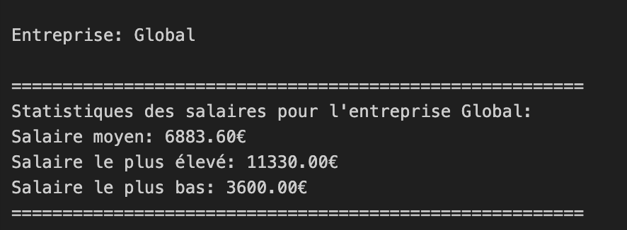
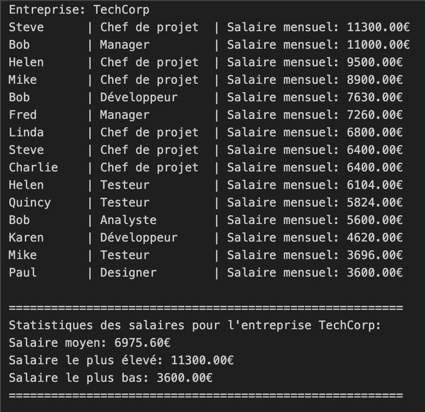
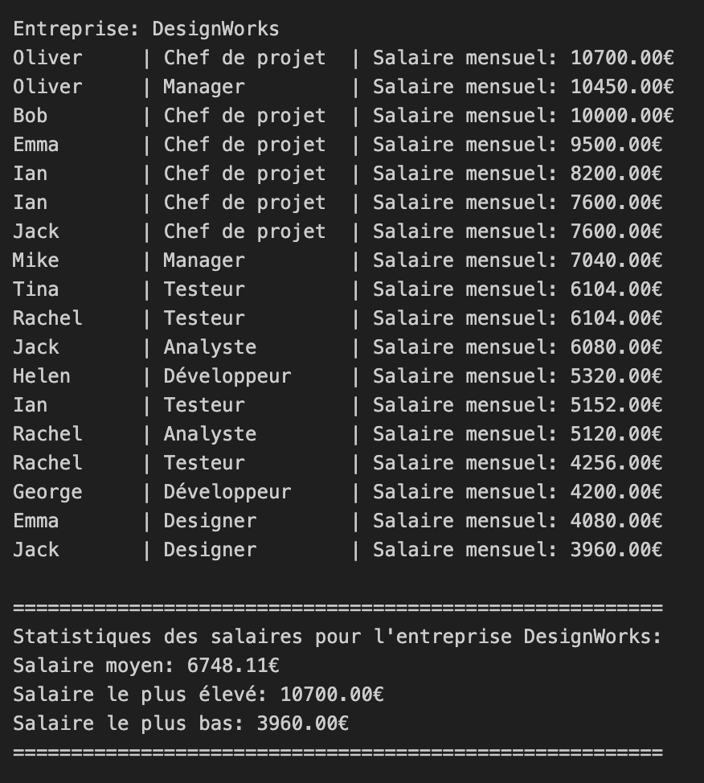
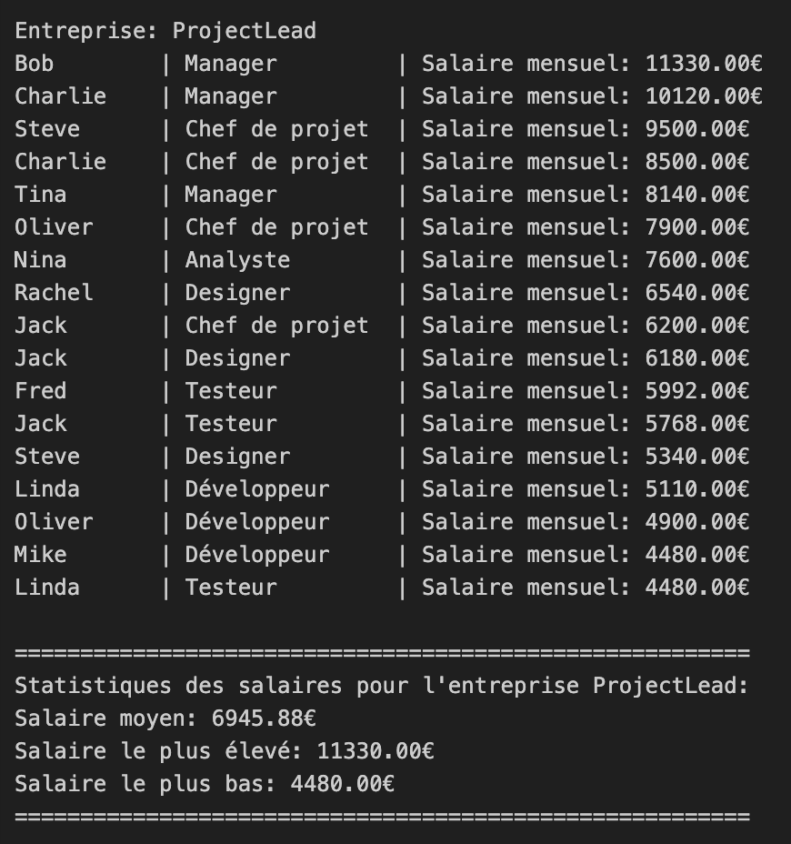

# Salary Manager

## Overview

The salary manager project calculates employee salaries for a company with three subsidiaries. The goal of the project is to determine the average, maximum and minimum salary of the compnay, both on a global scale and on a per subsdiary basis. The final results are vizualized using streamlit. 

data processing, analysis, and visualization . This repository includes:
  - Raw data loading and cleaning (_load_data.py_, _employees_data.json_).  
  - Export pipelines to generate subsidiary and global statistics (_export_data.py_, _salary_accounting.py_).  
  - Batch reporting and console output scripts (_display_results.py_, _main.py_).  
  - Interactive dashboard for visual exploration (_salary_manager_v2.py_).  
  - Jupyter notebook for prototyping company-level salary calculators (_salary_calculator_company_subsidiaries.ipynb_).

---

## Features

- **Data loading & cleaning**: `load_data.py` ingests raw JSON/CSV, normalizes columns, and handles missing values.
- **Automated exports**: `export_data.py` and `salary_accounting.py` generate CSV reports for 3 and 8 subsidiaries, plus a consolidated streamlit CSV.
- **Batch reporting**: `display_results.py` and `main.py` print console summaries for each company and global statistics.
- **Prototyping notebook**: `salary_calculator_company_subsidiaries.ipynb` demonstrates salary calculations across multiple subsidiaries.
- **Interactive dashboard**: `salary_manager_v2.py` provides filtering, KPIs, charts (boxplots, bar charts, heatmaps), and CSV download.

---

## App Versions

- **`salary_manager_v2.py`**: The most recent and recommended version.  
  - Modern UI, robust filtering, and advanced charts.
- **`salary_manager_v1.py`**: Legacy version for reference.

---

## How to Launch

1. **Install dependencies** (in your project folder):
	```bash
	pip install -r requirements.txt
	```
2. **Run the app** (recommended version):
	```bash
	streamlit run salary_manager_v2.py
	```
3. **Open in browser**: The app will launch at [http://localhost:8501](http://localhost:8501).

---

## File Connections

- **`salary_manager_v2.py`**: Main Streamlit app. Loads data, provides UI, and handles all dashboard logic.
- **`salary_statistics_streamlit.csv`**: Main data source. Contains salary records for all companies and roles.
- **`load_data.py`, `export_data.py`, `display_results.py`**: Utility scripts for data loading, exporting, and displaying results (used in earlier versions or for batch processing).
- **`Console_screenshots/`**: Contains PNG images of company stats, used below for visual reference.

---

## Example Screenshots

### Global Stats


### TechCorp


### DesignWorks


### ProjectLead



---

## Notes

- **Data updates**: To use new data, replace `salary_statistics_streamlit.csv` and restart the app.
- **Customization**: You can extend the dashboard by editing `salary_manager_v2.py` and adding new charts or filters.
- **Legacy scripts**: Older scripts are kept for reference and batch processing; all dashboard features are now in v2.

---

## License

MIT License (or specify your own).

---

If you have any issues or want to contribute, feel free to open an issue or pull request!
